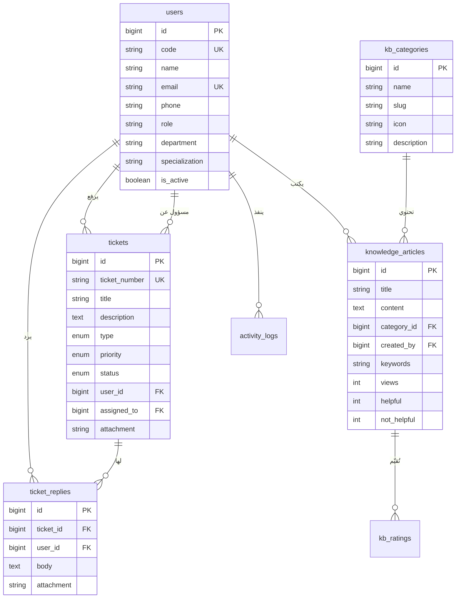
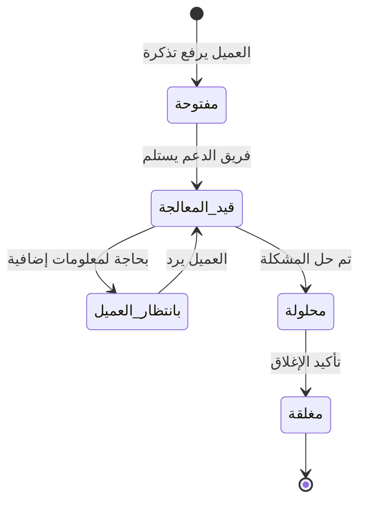

<div align="center">


# 🎫 نظام دعم عملاء إبداع ميديا

**منصة متكاملة لإدارة تذاكر الدعم الفني وقاعدة المعرفة**

[](https://laravel.com)
[](https://php.net)
[](https://tailwindcss.com)
[](https://vitejs.dev)
[](https://docker.com)

---

[المميزات](#-المميزات) · [البنية التقنية](#-البنية-التقنية) · [التثبيت](#-التثبيت) · [واجهة API](#-واجهة-api) · [الأدوار والصلاحيات](#-الأدوار-والصلاحيات) · [لقطات الشاشة](#-لقطات-الشاشة)

</div>

---

## 📖 نبذة عن المشروع

نظام **دعم عملاء إبداع ميديا** هو تطبيق ويب شامل مبني على إطار عمل **Laravel 12** مصمم خصيصاً لإدارة تذاكر الدعم الفني والمحاسبي. يوفّر النظام واجهة مستخدم عصرية بالعربية مع دعم كامل للوضع الداكن، بالإضافة إلى واجهة **RESTful API** محمية بـ **Sanctum** لربط التطبيقات الخارجية.

يهدف النظام إلى تحسين تجربة العملاء من خلال تقديم آلية منظمة لرفع التذاكر ومتابعتها، مع توفير قاعدة معرفة شاملة تساعد في حل المشاكل الشائعة بشكل ذاتي.

---

## ✨ المميزات

### 🎟️ إدارة التذاكر
| الميزة | الوصف |
|--------|-------|
| **إنشاء التذاكر** | رفع تذاكر جديدة مع تحديد النوع (تقني / محاسبي / طلب تطوير) والأولوية (عادية / مرتفعة / عاجلة) |
| **ترقيم تلقائي** | توليد رقم فريد لكل تذكرة بصيغة `TKT-YYYYMMDD-XXXX` |
| **تتبع الحالة** | خمس حالات: مفتوحة → قيد المعالجة → بانتظار العميل → محلولة → مغلقة |
| **نظام الردود** | محادثة ثنائية بين العميل وفريق الدعم مع إرفاق ملفات |
| **تعيين المسؤول** | إسناد التذاكر لأعضاء فريق الدعم المتخصصين |
| **إرفاق الملفات** | دعم رفع المرفقات (JPG, PNG, PDF) حتى 2 ميجابايت |
| **الإشعارات** | إشعارات داخلية عند تحديث حالة التذكرة |

### 📚 قاعدة المعرفة
- مقالات مساعدة مصنّفة بتصنيفات ذكية (🚀 كيف تبدأ، ⚠️ مشاكل شائعة، 📊 التقارير، ⚙️ الإعدادات، 💰 العمليات المحاسبية، ❓ أسئلة شائعة)
- عدّاد مشاهدات لكل مقالة
- نظام تقييم المقالات (مفيد / غير مفيد)
- بحث بالكلمات المفتاحية

### 📊 التقارير والإحصائيات
- **لوحة تحكم تفاعلية** مع إحصائيات فورية (مفتوحة، قيد المعالجة، محلولة، عاجلة)
- تقارير حسب النوع والأولوية
- تحليل أداء فريق الدعم
- تقارير شهرية مفصّلة
- متوسط وقت الاستجابة
- رسوم بيانية لآخر 7 أيام

### 👥 إدارة المستخدمين
- إنشاء حسابات جديدة مع أكواد موظفين تلقائية بصيغة `EMP-XXX`
- تفعيل / تعطيل الحسابات
- إعادة تعيين كلمات المرور
- تصنيف حسب الأقسام والتخصصات

---

## 🔐 الأدوار والصلاحيات

```
┌─────────────────────────────────────────────────────────────────┐
│                        الأدوار في النظام                        │
├──────────────────┬──────────────────────────────────────────────┤
│  🛡️ مشرف (admin) │ صلاحيات كاملة: إدارة المستخدمين،           │
│                  │ التذاكر، التقارير، قاعدة المعرفة             │
├──────────────────┼──────────────────────────────────────────────┤
│  🔧 دعم فني     │ إدارة التذاكر، الرد، تغيير الحالة،          │
│   (support)      │ عرض التقارير، إدارة قاعدة المعرفة           │
├──────────────────┼──────────────────────────────────────────────┤
│  💼 مدير مالي    │ عرض تذاكر قسمه، متابعة الأداء              │
│(financial_manager)│                                             │
├──────────────────┼──────────────────────────────────────────────┤
│  📋 محاسب        │ رفع تذاكر جديدة، متابعة تذاكره الخاصة     │
│  (accountant)    │                                              │
└──────────────────┴──────────────────────────────────────────────┘
```

---

## 🏗 البنية التقنية

### التقنيات المستخدمة

| الطبقة | التقنية | الإصدار |
|--------|---------|---------|
| **الخلفية (Backend)** | Laravel Framework | 12.x |
| **لغة البرمجة** | PHP | 8.2+ |
| **الواجهة (Frontend)** | Blade Templates + TailwindCSS | 4.0 |
| **أدوات البناء** | Vite | 7.x |
| **مصادقة API** | Laravel Sanctum | — |
| **قواعد البيانات** | MySQL / PostgreSQL / SQLite | — |
| **الحاويات** | Docker (PHP 8.2 + Apache) | — |
| **الأيقونات** | Lucide Icons | — |

### هيكل المشروع

```
ibda3-fresh/
├── app/
│   ├── Http/
│   │   ├── Controllers/
│   │   │   ├── Api/                    # وحدات التحكم الخاصة بـ API
│   │   │   │   ├── AuthController      # المصادقة (تسجيل الدخول / الخروج)
│   │   │   │   ├── TicketController     # عمليات التذاكر
│   │   │   │   ├── KnowledgeController  # قاعدة المعرفة
│   │   │   │   ├── UserController       # إدارة المستخدمين
│   │   │   │   └── ReportController     # التقارير والإحصائيات
│   │   │   └── Web/                    # وحدات التحكم الخاصة بالويب
│   │   │       ├── TicketWebController
│   │   │       ├── KnowledgeWebController
│   │   │       ├── UserWebController
│   │   │       └── ReportWebController
│   │   └── Middleware/
│   ├── Models/
│   │   ├── User.php                    # المستخدمون (مع أكواد EMP تلقائية)
│   │   ├── Ticket.php                  # التذاكر (ترقيم TKT تلقائي)
│   │   ├── TicketReply.php             # ردود التذاكر
│   │   ├── KnowledgeArticle.php        # مقالات قاعدة المعرفة
│   │   ├── KbCategory.php             # تصنيفات قاعدة المعرفة
│   │   ├── KbRating.php               # تقييمات المقالات
│   │   └── ActivityLog.php            # سجل النشاطات
│   ├── Notifications/
│   │   └── TicketUpdatedNotification   # إشعارات تحديث التذاكر
│   └── Providers/
├── database/
│   ├── migrations/                     # 10 ملفات هجرة
│   └── seeders/
│       └── DatabaseSeeder.php          # بيانات تجريبية جاهزة
├── resources/
│   └── views/
│       ├── layouts/                    # القوالب الأساسية
│       ├── auth/                       # صفحة تسجيل الدخول
│       ├── dashboard.blade.php         # لوحة التحكم الرئيسية
│       ├── tickets/                    # صفحات التذاكر
│       ├── knowledge/                  # صفحات قاعدة المعرفة
│       ├── users/                      # صفحات إدارة المستخدمين
│       ├── reports/                    # صفحات التقارير
│       └── components/                 # مكونات قابلة لإعادة الاستخدام
├── routes/
│   ├── web.php                         # مسارات الويب (محمية بـ auth)
│   └── api.php                         # مسارات API (محمية بـ Sanctum)
├── Dockerfile                          # إعداد Docker
├── vite.config.js                      # إعداد Vite + TailwindCSS
└── composer.json                       # اعتماديات PHP
```

---

## 🚀 التثبيت

### المتطلبات الأساسية

- **PHP** >= 8.2
- **Composer** >= 2.x
- **Node.js** >= 18.x و **npm**
- **MySQL** أو **PostgreSQL** أو **SQLite**

### التثبيت المحلي

```bash
# 1. استنساخ المستودع
git clone https://github.com/your-username/ibda3-fresh.git
cd ibda3-fresh

# 2. تشغيل الإعداد التلقائي (تثبيت الاعتماديات + توليد المفتاح + الهجرة + بناء الأصول)
composer setup

# 3. تعبئة البيانات التجريبية
php artisan db:seed

# 4. تشغيل خادم التطوير (Laravel + Queue + Vite + Logs في نافذة واحدة)
composer dev
```

> **ملاحظة:** أمر `composer setup` يقوم تلقائياً بـ:
> - تثبيت حزم PHP عبر Composer
> - نسخ ملف `.env.example` إلى `.env`
> - توليد مفتاح التطبيق
> - تنفيذ الهجرات
> - تثبيت حزم npm وبناء الأصول

### التثبيت عبر Docker (Docker Compose)

النظام مهيأ للعمل بالكامل باستخدام **Docker Compose** عبر ثلاث حاويات (PHP-FPM و Nginx و MySQL).

```bash
# تشغيل جميع الخدمات في الخلفية
docker compose up -d

# إيقاف الخدمات
docker compose down
```

يتم تشغيل التطبيق على المنفذ **`8081`**، ويمكنك الوصول إليه عبر الرابط التالي:
[http://localhost:8081](http://localhost:8081)

وستقوم الحاوية تلقائياً بتهيئة التطبيق وتثبيت الاعتماديات وتوليد المفتاح وضبط الصلاحيات عند التشغيل الأول.

---

## ⚙️ إعداد البيئة

انسخ ملف `.env.example` إلى `.env` وعدّل الإعدادات حسب بيئتك:

```env
# إعدادات التطبيق
APP_NAME="إبداع ميديا"
APP_URL=http://localhost:8000

# إعدادات قاعدة البيانات
DB_CONNECTION=mysql         # أو pgsql أو sqlite
DB_HOST=127.0.0.1
DB_PORT=3306
DB_DATABASE=ibda3_support
DB_USERNAME=root
DB_PASSWORD=secret

# إعدادات الجلسات والتخزين المؤقت
SESSION_DRIVER=database
CACHE_STORE=database
QUEUE_CONNECTION=database
```

---

## 🌐 واجهة API

جميع مسارات الـ API محمية بمصادقة **Laravel Sanctum** (ما عدا تسجيل الدخول).

### 🔑 المصادقة

| الطريقة | المسار | الوصف |
|---------|--------|-------|
| `POST` | `/api/login` | تسجيل الدخول والحصول على Token |
| `POST` | `/api/logout` | تسجيل الخروج وإبطال Token |
| `GET` | `/api/me` | بيانات المستخدم الحالي |

### 🎟️ التذاكر

| الطريقة | المسار | الوصف |
|---------|--------|-------|
| `GET` | `/api/tickets` | عرض التذاكر (مع فلترة وبحث) |
| `POST` | `/api/tickets` | إنشاء تذكرة جديدة |
| `GET` | `/api/tickets/{id}` | عرض تفاصيل تذكرة |
| `PUT` | `/api/tickets/{id}` | تحديث حالة / أولوية / مسؤول التذكرة |
| `POST` | `/api/tickets/{id}/replies` | إضافة رد على تذكرة |

**فلاتر التذاكر المتاحة:**
```
GET /api/tickets?status=open&priority=urgent&type=technical&search=كلمة_البحث
```

### 📚 قاعدة المعرفة

| الطريقة | المسار | الوصف |
|---------|--------|-------|
| `GET` | `/api/kb/categories` | عرض التصنيفات |
| `GET` | `/api/kb/articles` | عرض المقالات |
| `POST` | `/api/kb/articles` | إنشاء مقالة جديدة |
| `GET` | `/api/kb/articles/{id}` | عرض مقالة |
| `PUT` | `/api/kb/articles/{id}` | تحديث مقالة |
| `DELETE` | `/api/kb/articles/{id}` | حذف مقالة |
| `POST` | `/api/kb/articles/{id}/rate` | تقييم مقالة |

### 👥 المستخدمون

| الطريقة | المسار | الوصف |
|---------|--------|-------|
| `GET` | `/api/users` | عرض المستخدمين |
| `POST` | `/api/users` | إنشاء مستخدم جديد |
| `PUT` | `/api/users/{id}` | تحديث بيانات مستخدم |
| `POST` | `/api/users/{id}/reset-password` | إعادة تعيين كلمة المرور |
| `GET` | `/api/users/support-team` | عرض فريق الدعم |

### 📊 التقارير

| الطريقة | المسار | الوصف |
|---------|--------|-------|
| `GET` | `/api/reports/dashboard` | إحصائيات لوحة التحكم الشاملة |
| `GET` | `/api/reports/monthly?month=2024-01` | تقرير شهري مفصّل |

---

## 🧪 البيانات التجريبية

بعد تنفيذ `php artisan db:seed` يتم إنشاء الحسابات التالية:

| الدور | البريد الإلكتروني | كلمة المرور |
|-------|-------------------|-------------|
| 🛡️ مشرف | `admin@ibda3.com` | `Admin@1234` |
| 🔧 دعم فني (تقني) | `support1@ibda3.com` | `Support@1234` |
| 🔧 دعم فني (محاسبي) | `support2@ibda3.com` | `Support2@1234` |
| 🔧 مساعد تقني | `support3@ibda3.com` | `Support3@1234` |
| 💼 مدير مالي | `manager@ibda3.com` | `Manager@1234` |
| 📋 محاسب | `ali@ibda3.com` | `User@1234` |

كما يتم إنشاء:
- **6 تصنيفات** لقاعدة المعرفة
- **3 مقالات** تعليمية
- **5 تذاكر** تجريبية بحالات مختلفة مع ردود

---

## 🧰 أوامر مفيدة

```bash
# تشغيل بيئة التطوير الكاملة (Laravel + Queue + Vite + Logs)
composer dev

# تنفيذ الاختبارات
composer test

# تنفيذ الهجرات
php artisan migrate

# إعادة بناء قاعدة البيانات مع البيانات التجريبية
php artisan migrate:fresh --seed

# بناء أصول الإنتاج
npm run build

# تنسيق الكود
./vendor/bin/pint
```

---

## 📐 نموذج قاعدة البيانات



---

## 🔄 دورة حياة التذكرة



---

## 🤝 المساهمة

نرحب بمساهماتكم! يرجى اتباع الخطوات التالية:

1. **Fork** المستودع
2. أنشئ فرعاً جديداً: `git checkout -b feature/amazing-feature`
3. نفّذ تغييراتك وأضف اختبارات
4. تأكد من تنسيق الكود: `./vendor/bin/pint`
5. ارفع التغييرات: `git push origin feature/amazing-feature`
6. أرسل **Pull Request**

---

## 📄 الرخصة

هذا المشروع مرخص تحت رخصة [MIT](https://opensource.org/licenses/MIT).

---

<div align="center">

**صنع بـ ❤️ بواسطة فريق [إبداع ميديا](https://ibda3.com)**

<sub>نظام دعم عملاء إبداع ميديا © 2024-2026</sub>

</div>
